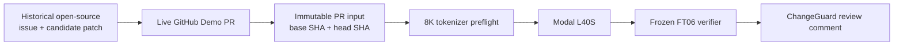
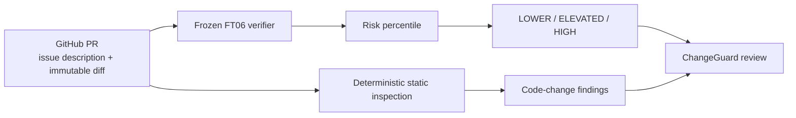

# ChangeGuard

ChangeGuard is an advisory pull-request triage tool built around a frozen, fine-tuned Qwen2.5-Coder-7B verifier. Given a PR description and diff, it produces a review-priority signal and shows a separate set of deterministic code-change findings.

It does **not** approve a patch, auto-merge it, block it, or execute code from the PR.

## Why this project

AI coding agents can produce patches quickly, but deciding whether a patch actually solves the issue without introducing a regression is still hard. ChangeGuard tests a narrower question: can a relatively small verifier learn a useful patch-correctness signal and fit into a normal GitHub review workflow?

The current claim is intentionally limited. FT06 works best on data close to its training distribution and loses accuracy as the distribution shift becomes harder.

| Frozen evaluation split | ROC-AUC | Unsafe PR-AUC |
|---|---:|---:|
| ID | 0.8200 | 0.9656 |
| Repo-OOD | 0.7479 | 0.9121 |
| Policy-OOD | 0.6751 | 0.7080 |
| Hard-match | 0.5972 | 0.5900 |
| SWE-Review external | 0.6540 | 0.6264 |

The trend matters as much as the best number: performance is strongest in-distribution, remains useful on held-out repositories, and drops on harder matched and external evaluations. That is why ChangeGuard is presented as a review-priority tool rather than a universal verifier.

The deterministic rules are not part of the model score. In a frozen A/B/C evaluation, combining the rule signal with FT06 reduced hard-match unsafe PR-AUC from **0.5900 to 0.5150** (delta **-0.0750**, 95% CI **[-0.0981, -0.0559]**). The rules are therefore shown as review context instead of being fused into the learned score.

## Live replay demos

The open `[Demo]` pull requests replay historical real-world open-source issue/candidate-patch pairs through the deployed ChangeGuard workflow.



These are deployment demos, not a model-generalization benchmark. Four are frozen FT06 training examples and one is a held-out ID example. Generalization is reported separately in the evaluation table above.

- [#13, more-itertools](https://github.com/tkim602/ChangeGuard/pull/13): SAFE reference, `LOWER` signal
- [#14, pandas](https://github.com/tkim602/ChangeGuard/pull/14): SAFE reference, `LOWER` signal
- [#15, pynetdicom](https://github.com/tkim602/ChangeGuard/pull/15): UNSAFE reference, `ELEVATED` signal
- [#16, moto](https://github.com/tkim602/ChangeGuard/pull/16): UNSAFE reference, `HIGH` signal
- [#17, flake8-comprehensions](https://github.com/tkim602/ChangeGuard/pull/17): SAFE reference, held-out ID, `LOWER` signal

## Architecture



The two paths are independent:

- **Model signal:** `LOWER`, `ELEVATED`, or `HIGH`, derived from the frozen FT06 calibration distribution.
- **Code-change findings:** public API changes, auth/workflow/config changes, missing test changes, removed validation, dangerous execution patterns, and analysis gaps.
- **Failure behavior:** an oversized input or model failure is reported as unavailable, never as low risk.

A static finding can disagree with the model signal. For example, a patch can receive `LOWER` from FT06 while still being flagged because production Python changed without a test-file change. The finding is a review hint; it does not change the model percentile.

## Try it on your repository

### Read-only CPU inspection

The reusable action can be added to another GitHub repository. It reads the PR, inspects the diff without executing PR code, and writes the result to the Actions summary.

```yaml
name: ChangeGuard

on:
  pull_request:

permissions:
  contents: read
  issues: read
  pull-requests: read

jobs:
  inspect:
    runs-on: ubuntu-latest
    steps:
      - uses: actions/setup-python@v7
        with:
          python-version: "3.12"
      - uses: tkim602/ChangeGuard@main
        with:
          github-token: ${{ github.token }}
          pull-request-number: ${{ github.event.pull_request.number }}
```

A complete example is in [`docs/examples/changeguard.yml`](docs/examples/changeguard.yml).

The reusable action is intentionally CPU-only. It does not run the FT06 model and does not post comments to the target PR. Once this repository is public, other public repositories can reference the action directly.

### Frozen FT06 model

The hosted FT06 path is currently **maintainer-gated**, not a public inference service. The adapter and calibration artifacts are not committed, and the Modal credentials stay in repository secrets.

For the deployed ChangeGuard repository, the model workflow can run on owner-authored `[Demo]` PRs, on a PR labeled `changeguard-model`, or through manual workflow dispatch. Arbitrary PR authors cannot spend GPU credit just by opening a PR.

The current deployment flow is:

```text
PR -> exact 8K preflight -> Modal L40S -> frozen adapter -> calibrated risk percentile -> one PR comment
```

PR text and the diff are sent to Modal when the model workflow runs. Do not use the GPU path for code that cannot leave GitHub.

## CI and GitHub Actions

There are three separate workflows because they serve different purposes.

| Workflow | Trigger | What it does |
|---|---|---|
| [`ci.yml`](.github/workflows/ci.yml) | push to `main`, pull request | installs the package and runs the test suite on Python 3.12 |
| [`changeguard-evidence.yml`](.github/workflows/changeguard-evidence.yml) | pull request | read-only CPU collection and deterministic inspection; uploads JSON/Markdown artifacts |
| [`changeguard-full.yml`](.github/workflows/changeguard-full.yml) | gated PR event or manual dispatch | exact tokenizer preflight, Modal FT06 inference, report rendering, and one marked PR comment |

The model workflow uses a per-PR concurrency group with `cancel-in-progress: true`, so a newer run replaces an older one for the same PR. The GitHub job has a 20-minute timeout and the Modal worker has a 15-minute timeout. If preflight or model execution fails, ChangeGuard reports the model as unavailable rather than falling back to a low-risk result.

## Local development

The CPU analyzer has no runtime package dependencies beyond Python itself.

```bash
python3 -m venv .venv
. .venv/bin/activate
python -m pip install -e '.[dev]'
pytest
```

Offline analysis accepts a collected PR payload containing `patch`, `before_after`, `base_sha`, and `head_sha`:

```bash
python -m changeguard.github_demo analyze \
  --input pr.json \
  --output changeguard.json \
  --markdown changeguard.md
```

## Reproducibility and limits

- Base model: `Qwen/Qwen2.5-Coder-7B-Instruct`, pinned revision `c03e6d358207e414f1eca0bb1891e29f1db0e242`.
- The deployed adapter, adapter config, prompt, and calibration artifacts are SHA-256 checked before scoring.
- Inputs above 8,192 tokens are rejected without truncation.
- The model produces a calibrated review-priority signal, not a merge decision.
- The static analyzer does not execute code from the PR.
- Training/evaluation datasets, model weights, and private experiment archives are not included in this repository.

A short project report with the experiment timeline, dataset construction, ablations, and evaluation details will be added separately so the README can stay focused on the working system.
